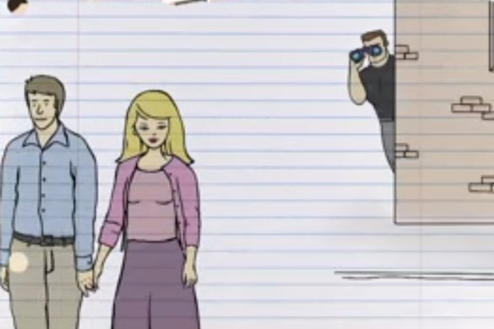

[](https://github.com/nethanelkohen/Mommys_Watching)
[](https://github.com/nethanelkohen/Mommys_Watching/issues)
[](https://github.com/nethanelkohen/Mommys_Watching/pulls)
[](https://github.com/nethanelkohen/Mommys_Watching/blob/master/LICENSE)



# Mommy's Watching

 <br>

### _Give Your Sober Friends Peace of Mind_

A mobile app created by [Nethanel Kohen](https://github.com/nethanelkohen) and [Martin Pham](https://github.com/martinliempham) that lets friends stay connected after their night out.

<br>

## Getting Started

**This App will only run on iOS.**

Download the [Expo Client for iOS](https://itunes.apple.com/app/apple-store/id982107779?ct=www&mt=8).

Then, scan the QR code below:


or go to our [project](https://expo.io/@nethanelkohen/Mommys-Watching) on Expo.

On the home screen, type in your desired message in the text input and choose a friend from your contacts list. Press the save icon to save your message and the contact you will send that message to and navigate to the map screen to search for a location. When you are ready to go home or leave for the night, click the bullseye to begin tracking your location! Once you are within 50 meters of your endpoint, your friend will receive your message from a Twilio number ((210)-508-0050). If you'd like to cancel your message, simply click the X to turn everything off.

## Project Structure

```
├── Mommys_Watching    # Source code
│   ├── App.js         ## Begins navigation
│   ├──app.json        ## Handles Expo render data
│   ├── assets         ## Static assets
│   │   └── images     ### Images (png)
│   ├── components     ## Any shared components
│   │   └── ContactsComponent.js     ### Renders user contact and saves to storage
│   │   └── Map.js     ### Renders map, location tracking and makes Twilio API call
│   │   └── TextMessage.js     ### Renders user message and saves to storage
│   └── screens        ### Any shared components
│       └── HomeScreen.js     ### Navigates to contact/message screen
│       └── MapScreen.js      ### Navigates to map
│
└── Mommys_Watching Server # Handles Twilio post API call
```

## What's Inside


[React-Native](https://facebook.github.io/react-native/)


[Expo](https://expo.io/)


[Twilio](https://www.twilio.com/)

<br>

## Contribute

Add to our project! Please read the [contribution guidelines](CONTRIBUTING.md) first.

# Inspiration

* [Nathan for You](https://www.youtube.com/watch?v=xMW-SzZKJ-Q) - Name/concept
* [Find My Friends](https://itunes.apple.com/us/app/find-my-friends/id466122094?mt=8) - Tracking/sharing location features

## Acknowledgements

This app was built using [Create-React-Native-App](https://github.com/react-community/create-react-native-app). Big shout-out to the [Expo](https://github.com/expo) team for all the work they do.

## License

This React-Native app is under the [MIT License](https://github.com/nethanelkohen/ByeBye/blob/master/LICENSE).
